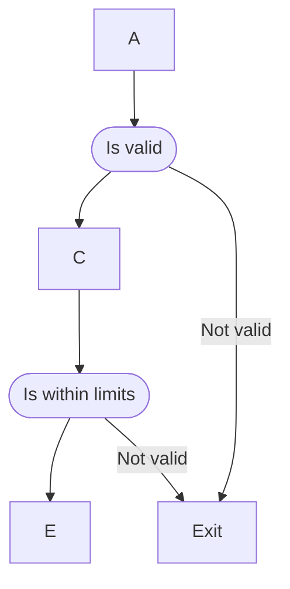
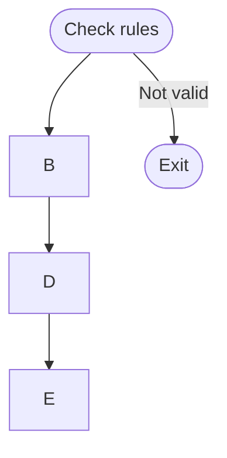
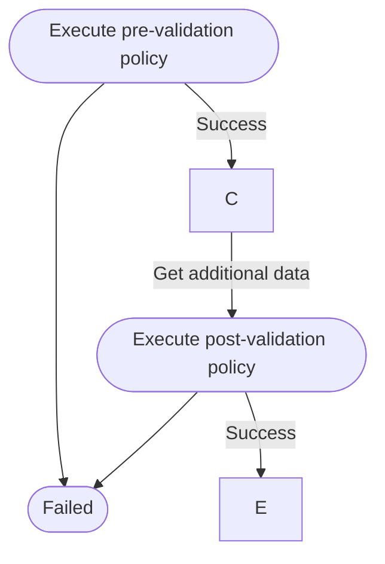

# flow rules 

**WORK IN PROGRESS**

A simple rules implementation for dotnet. Intended for use within a microservice implementation.

## CI

| Project | Build (master) |  Build (develop) |
|---------|-------|-------|
| [FlowRules](https://github.com/p1971/flow.rules.engine) |  |   |

## Testing

[](https://codecov.io/gh/p1971/flow.rules.engine)

## Packaging

Packages from feature and develop branches are available on [github](https://github.com/p1971?tab=packages&repo_name=flow.rules).

Release and symbol packages are available on [nuget.org](https://www.nuget.org/packages/FlowRules.Engine).

| Nuget | Description | Nuget |
| ------| ------- | ------ |
| FlowRules.Engine | Core engine | [](https://www.nuget.org/packages/FlowRules.Engine) |
| FlowRules.Extensions.SqlServer | Sql server support | [](https://www.nuget.org/packages/FlowRules.Extensions.SqlServer) |

## Why use a rules engine ?

### Benefits

Using a rules engine allows the centralization of the logic within an application. This is easier to maintain, easier to test and can simplify process flow.

A simple analogy of this would be validation rules for a user input form.

A bad process, from the user perspective, would be to validate one rule at a time; the user enters some data, submits and is presented with an error. The user corrects re-submits and sees another error, corrects and re-submits and so on. A better approach is to validate the whole form in one go showing the user all the current errors on the form, allowing them to correct and re-submit in one go.

For general business processes the principle is the same; gather all the required data, submit it to the rules engine and check the response. If the response is valid, continue processing, else terminate the process.

This works very well when paired with a [workflow engine](https://github.com/p1971/flow.engine).

Lets consider a traditional process flow.



And now with a rules engine.



### Downsides

There are some downsides to this approach.

Some rules engines use a DSL (domain specific language) which would require developers to switch away from a language they are familiar with to one they may not know and is perhaps harder to debug.

In order or present a rich domain model to the rules engine, the process flow may require expensive service calls to provide all the data that the engine needs. This might be short circuited in a more traditional approach, skipping un-necessary api calls for example. This can be alleviated however by splitting the rules policies / process flow into a pre and post-process steps for example.



## Getting started

### A simple dto to apply rules against

```csharp
public record MortgageApplication(int ApplicantAge, string MortgageType, int LoanAmount);
```

### The rules policy

```csharp

public class PolicyBuilder 
{
    public Policy<MortgageApplication> GetPolicy()
    {
     Rule<MortgageApplication> validMortgageTypeRule = new(
        "MA001",
        "KnownMortgageType",
        "Checks the mortgage type",
        (r) => $"The {nameof(r.MortgageType)} [{r.MortgageType}] is not known.",
        (request, token) =>
        {
            ColumnResolver mortgageType = lookup["Default"][request.MortgageType];
            return Task.FromResult(mortgageType != null);
        });

    Rule<MortgageApplication> ageLimitRule = new(
        "MA002",
        "MinAgeCheck",
        "Minimum age of the applicant",
        (r) => $"The {nameof(r.ApplicantAge)} [{r.ApplicantAge}] is too young.",
        (request, token) =>
        {
            int minAgeForMortgage = lookup["Default"][request.MortgageType]["MinApplicantAge"].As<int>();
            return Task.FromResult(request.ApplicantAge >= minAgeForMortgage);
        });

    Policy<MortgageApplication> policy = new(
        "P001",
        "LoanPolicy",
        new List<Rule<MortgageApplication>>
        {
            validMortgageTypeRule,
            ageLimitRule,        
        });
       return policy;
    }
}
```

### Registering the services and executing a request

```csharp
ServiceCollection serviceCollection = new();

serviceCollection.AddFlowRules<MortgageApplication>(() => policy);

ServiceProvider serviceProvider = serviceCollection.BuildServiceProvider();

IPolicyManager<MortgageApplication> policyManager = serviceProvider.GetService<IPolicyManager<MortgageApplication>>();

MortgageApplication testMortgage = new(21, "FTB", 200_000);

CancellationTokenSource cancellationTokenSource = new();
CancellationToken cancellationToken = cancellationTokenSource.Token;

PolicyExecutionResult results = await policyManager.Execute(Guid.NewGuid(), testMortgage, cancellationToken);
```

## Authors

- Pete Robinson
