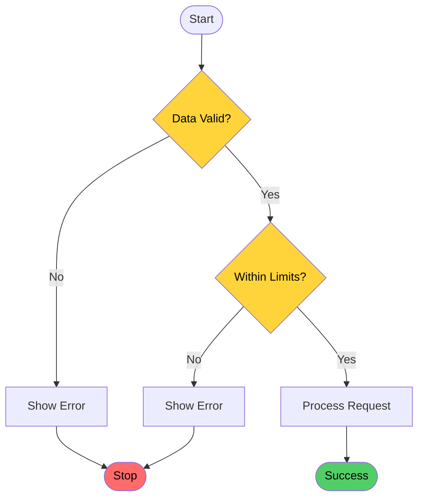
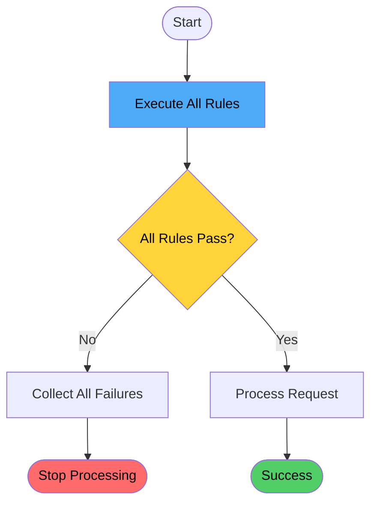
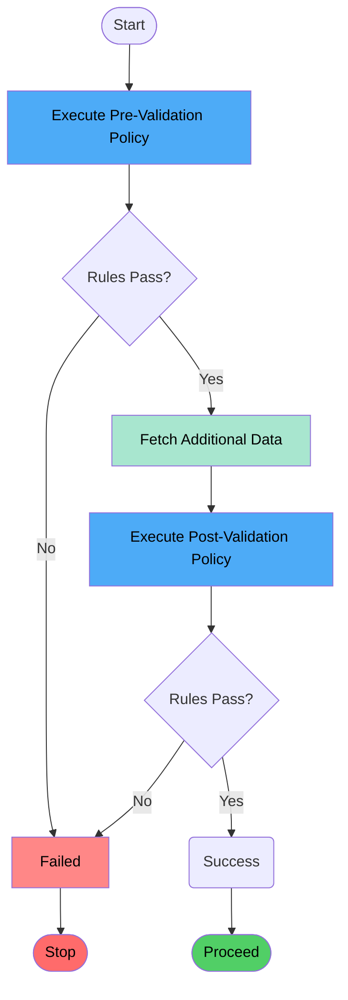

# flow rules 

A simple rules implementation for dotnet. Intended for use within a microservice implementation.

## CI

| Project | Build (main) |  Build (develop) |
|---------|-------|-------|
| [FlowRules](https://github.com/p1971/flow.rules.engine) | [](https://github.com/p1971/flow.rules/actions/workflows/workflow.yml) |  [](https://github.com/p1971/flow.rules/actions/workflows/workflow.yml) |


## Testing

[](https://codecov.io/gh/p1971/flow.rules)

## Packaging

Packages from feature and develop branches are available on [github](https://github.com/p1971?tab=packages&repo_name=flow.rules).

Release and symbol packages are available on [nuget.org](https://www.nuget.org/packages/FlowRules.Engine).

| Nuget | Description | Nuget |
| ------| ------- | ------ |
| FlowRules.Engine | Core engine | [](https://www.nuget.org/packages/FlowRules.Engine) |
| FlowRules.Extensions.SqlServer | Sql server support | [](https://www.nuget.org/packages/FlowRules.Extensions.SqlServer) |

## Why use a rules engine ?

### Benefits

Using a rules engine allows the centralization of the logic within an application. This is easier to maintain, easier to test and can simplify process flow.

A simple analogy of this would be validation rules for a user input form.

A bad process, from the user perspective, would be to validate one rule at a time; the user enters some data, submits and is presented with an error. The user corrects re-submits and sees another error, corrects and re-submits and so on. A better approach is to validate the whole form in one go showing the user all the current errors on the form, allowing them to correct and re-submit in one go.

For general business processes the principle is the same; gather all the required data, submit it to the rules engine and check the response. If the response is valid, continue processing, else terminate the process.

This works very well when paired with a [workflow engine](https://github.com/p1971/flow.engine).

Lets consider a traditional process flow.


```mermaid
flowchart TD
    Start([Start]) --> ValidCheck{Data Valid?}
    ValidCheck -->|No| ShowError1["Show Error"]
    ShowError1 --> End1([Stop])
    ValidCheck -->|Yes| LimitCheck{Within Limits?}
    LimitCheck -->|No| ShowError2["Show Error"]
    ShowError2 --> End1
    LimitCheck -->|Yes| Process["Process Request"]
    Process --> End2([Success])
    
    style End1 fill:#ff6b6b,color:#000000
    style End2 fill:#51cf66,color:#000000
    style ValidCheck fill:#ffd43b,color:#000000
    style LimitCheck fill:#ffd43b,color:#000000    
```

And now with a rules engine.


```mermaid
flowchart TD
    Start([Start]) --> CheckRules["Execute All Rules"]
    CheckRules --> AllPass{All Rules Pass?}
    AllPass -->|No| CollectErrors["Collect All Failures"]
    CollectErrors --> Exit1([Stop Processing])
    AllPass -->|Yes| ProcessData["Process Request"]
    ProcessData --> End([Success])
    
    style Exit1 fill:#ff6b6b,color:#000000
    style End fill:#51cf66,color:#000000
    style CheckRules fill:#4dabf7,color:#000000
    style AllPass fill:#ffd43b,color:#000000
```

### Downsides

There are some downsides to this approach.

Some rules engines use a DSL (domain specific language) which would require developers to switch away from a language they are familiar with to one they may not know and is perhaps harder to debug.

In order to present a rich domain model to the rules engine, the process flow may require expensive service calls to provide all the data that the engine needs. This might be short circuited in a more traditional approach, skipping un-necessary api calls for example. This can be alleviated however by splitting the rules policies / process flow into a pre and post-process steps for example.


```mermaid
flowchart TD
    Start([Start]) --> PreValidate["Execute Pre-Validation Policy"]
    PreValidate --> PreResult{Rules Pass?}
    PreResult -->|No| Failed["Failed"]
    Failed --> Exit([Stop])
    
    PreResult -->|Yes| FetchData["Fetch Additional Data"]
    FetchData --> PostValidate["Execute Post-Validation Policy"]
    PostValidate --> PostResult{Rules Pass?}
    PostResult -->|No| Failed
    PostResult -->|Yes| Success("Success")
    Success --> End([Proceed])
    
    style Exit fill:#ff6b6b,color:#000000
    style End fill:#51cf66,color:#000000
    style Failed fill:#ff8787,color:#000000
    style PreValidate fill:#4dabf7,color:#000000
    style PostValidate fill:#4dabf7,color:#000000
    style FetchData fill:#a8e6cf,color:#000000
```

## Getting started

### FlowRules concepts

A policy is a collection of rules.

| Name           | Description                                 | Example             |
| -------------- | ------------------------------------------- | ------------------- |
| Id             | A unique identifier for the policy.         | P0001               |
| Name           | A human readable name for the policy.       | BasicDecisionPolicy |
| Description    | A description for the policy.               | Basic checks.       |
| Version        | An optional version for audit and persisted results. | 1.0.0 |
| Rules          | The list of rules belonging to the policy.  |                     |

A rule is an assertion which must be true to pass.

| Name           | Description                                                   | Example     |
| -------------- | ------------------------------------------------------------- | ----------- |
| Id             | A unique identifier for the rule.                             | R0001       |
| Name           | A human readable name for the rule.                           | ValidateAge |
| Description    | A description for the rule.                                   | Checks the applicants age.            |
| FailureMessage | A function that returns a failure message, if the rule fails. The request data is passed to the function. | ```(r) => $"{r.Name} is too young."```             |
| Source         | The actual rule code to execute, the request data and a cancellation token are passed.                              | ```(r, c) => r.Age > 21```            |

### A simple dto to apply rules against

```csharp
public record MortgageApplication(
    int ApplicantAge,
    string ProductType,
    decimal PropertyValue,
    decimal DepositAmount,
    decimal GrossAnnualIncome,
    decimal NetMonthlyIncome,
    decimal CommittedMonthlyExpenditure,
    decimal EssentialMonthlyExpenditure,
    int Dependants,
    int LoanTermYears,
    int ExpectedRetirementAge,
    decimal ProductRate,
    decimal StressRate,
    bool IncomeVerified,
    bool ExpenditureVerified,
    bool HasCredibleRepaymentStrategy = false,
    decimal RepaymentStrategyMonthlyCost = 0)
{
    public decimal LoanAmount => PropertyValue - DepositAmount;
}
```

### The rules policy

The sample mortgage policy is an illustrative UK regulated residential lending policy. It uses lender policy limits for LTV/LTI and affordability stress checks, and avoids buy-to-let rental coverage or DSCR calculations.

```csharp
public static class PolicySetup
{
    public static Policy<MortgageApplication> GetPolicy()
    {
        return PolicyBuilder<MortgageApplication>.Create()
            .WithId("P001")
            .WithName("UKResidentialMortgagePolicy")
            .WithDescription("Illustrative UK regulated residential mortgage lending policy.")
            .WithVersion("2.0.0")
            .WithRule(
                "MA001",
                "SupportedProductType",
                (request, token) => ValueTask.FromResult(
                    request.ProductType is "ResidentialRepayment" or "ResidentialInterestOnly"),
                failureMessage: request => $"The product type [{request.ProductType}] is not supported.")
            .WithRule(
                "MA006",
                "LoanToValue",
                (request, token) => ValueTask.FromResult(
                    request.LoanAmount / request.PropertyValue * 100 <= 90.0m),
                failureMessage: request => $"LTV exceeds the sample product limit.")
            .WithRule(
                "MA007",
                "LoanToIncome",
                (request, token) => ValueTask.FromResult(
                    request.LoanAmount / request.GrossAnnualIncome <= 4.50m),
                failureMessage: request => $"LTI exceeds the sample lender limit.")
            .WithRule(
                "MA009",
                "AffordabilityStress",
                async (request, token) =>
                {
                    await Task.Delay(5, token);
                    decimal stressRate = Math.Max(request.StressRate, request.ProductRate + 1.00m);
                    decimal stressedPayment = request.LoanAmount * stressRate / 100 / 12;
                    decimal monthlyOutgoings =
                        request.CommittedMonthlyExpenditure
                        + request.EssentialMonthlyExpenditure
                        + stressedPayment;

                    return request.IncomeVerified
                        && request.ExpenditureVerified
                        && request.NetMonthlyIncome - monthlyOutgoings >= 250m;
                },
                failureMessage: request => "Affordability stress failed.")
            .Build();
    }
}
```

### Registering the services and executing a request

```csharp
ServiceCollection serviceCollection = new();

serviceCollection.AddFlowRules<MortgageApplication>(() => policy);

ServiceProvider serviceProvider = serviceCollection.BuildServiceProvider();

IPolicyManager<MortgageApplication> policyManager =
    serviceProvider.GetService<IPolicyManager<MortgageApplication>>();

MortgageApplication testMortgage = new(
    ApplicantAge: 35,
    ProductType: "ResidentialRepayment",
    PropertyValue: 350_000,
    DepositAmount: 70_000,
    GrossAnnualIncome: 85_000,
    NetMonthlyIncome: 5_000,
    CommittedMonthlyExpenditure: 300,
    EssentialMonthlyExpenditure: 1_200,
    Dependants: 1,
    LoanTermYears: 30,
    ExpectedRetirementAge: 68,
    ProductRate: 5.00m,
    StressRate: 6.25m,
    IncomeVerified: true,
    ExpenditureVerified: true);

CancellationTokenSource cancellationTokenSource = new();
CancellationToken cancellationToken = cancellationTokenSource.Token;

PolicyExecutionResult results = await policyManager.Execute(Guid.NewGuid().ToString(), Guid.NewGuid(), testMortgage, cancellationToken);
```

### Persisting results

Results can be persisted via the `IPolicyResultsRepository<in T>` implementation. The default implementation is a no-op, so register a custom repository if you want to store execution results.

The interface is fairly simple:

```csharp
ValueTask PersistResults(T request, PolicyExecutionResult policyExecutionResult);
```

Where `PolicyExecutionResult` contains the policy and individual rule results.

`FlowRules.Extensions.SqlServer` contains an implementation that writes the results to SQL Server.

The [SqlServerPolicyResultsRepository.sql](https://github.com/p1971/flow.rules/blob/develop/src/FlowRules.Extensions.SqlServer/SQL/SqlServerPolicyResultsRepository.sql) can be used to create the database / schema required.

In order to use the SQL Server implementation, it can be registered when registering the FlowRules.

```csharp
builder.Services.AddFlowRules<MortgageApplication>(PolicySetup.GetPolicy, (c) =>
{
    c.ResultsRepository = typeof(SqlServerPolicyResultsRepository<MortgageApplication>);
});

```

Custom implementations can be registered similarly.

Telemetry is exported by default. To disable FlowRules telemetry registration, set `ExportTelemetry` to `false`:

```csharp
builder.Services.AddFlowRules<MortgageApplication>(PolicySetup.GetPolicy, (c) =>
{
    c.ExportTelemetry = false;
});
```

### Monitoring Performance

Built-in performance counters track execution time for policies and individual rules:

```bash
dotnet counters monitor --name FlowRules.Samples.WebApi --counters FlowRules
```

Example output:

```
[FlowRules]
    P001 (ms)                                          100
    P001:MA001 (ms)                                     20
    P001:MA002 (ms)                                     30
    P001:MA003 (ms)                                     40
    P001:MA004 (ms)                                     50
```

## Examples

See the [samples](./src) directory for complete working examples:

- **Console Application** - Simple console app demonstrating rule execution
- **Web API** - ASP.NET Core API with OpenTelemetry and distributed tracing
- **SQL Server Persistence** - Results storage using SQL Server

Run the samples with:

```bash
dotnet run --project ./src/FlowRules.Samples.WebApi
```

Test the API endpoints using the included `.http` files or your preferred REST client.

## Contributing

Contributions are welcome! Please feel free to submit issues and pull requests to the [main repository](https://github.com/p1971/flow.rules).

## License

MIT License - see LICENSE file for details.
